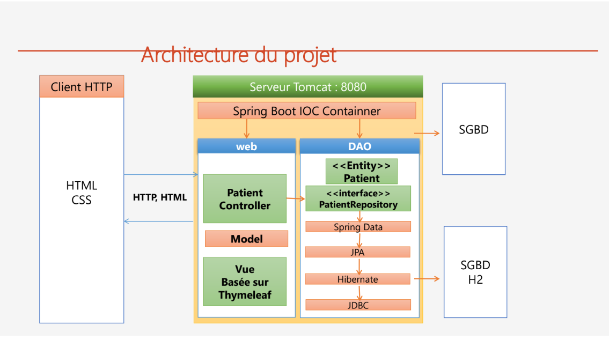

<h2>Servlet, JSP, Spring MVC, Thymeleaf</h2>
<h3>Spring MVC & Thymeleaf :</h3>

Spring MVC est un framework web puissant qui offre de nombreuses fonctionnalités pour la construction d'applications web. 
Thymeleaf est un moteur de template Java moderne qui peut être facilement intégré avec Spring MVC pour créer des vues HTML dynamiques.   
Ensemble, ils permettent de créer des applications web réactives, évolutives et faciles à maintenir.

<h3>Architecture Spring MVC :</h3>

<h3>Architecture du projet :</h3>

<h4>L'Entité JPA Patient :</h4>

<h4>L'interface patientRepository :</h4>

<h4>Le Contrôlleur patientController :</h4>

<h4>L'ensemble des Vues basées sur Thymeleaf :</h4>

